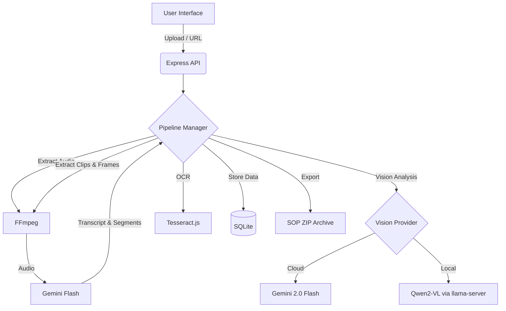

# ✦ SOPGen

**Video-to-SOP Generator** — Turn long videos into tutorial clips and professional step-by-step Standard Operating Procedure (SOP) documents automatically.

 *(Placeholder: Replace with actual logo or banner)*

---

## 🌟 Overview

SOPGen is an AI-powered pipeline designed to simplify the creation of documentation from video sources. Whether it's a recorded Zoom meeting, a software demo, or a YouTube tutorial, SOPGen analyzes the content, segments it into logical steps, extracts high-quality screenshots, and generates a structured SOP with instructions and code snippets.

## 🚀 Key Features

- **Multi-Source Ingest**: Upload local video files or provide a YouTube URL.
- **AI-Powered Pipeline**:
    - **Transcription**: Automated audio-to-text conversion via Gemini.
    - **Logical Segmentation**: Automatically breaks long videos into concise tutorial clips.
    - **Intelligent SOP Generation**: Uses vision models (Gemini or local Qwen-VL) to extract steps, instructions, and code from video frames.
- **OCR Integration**: Enhances instruction accuracy by reading text directly from video frames.
- **Flexible Vision Providers**: Switch between Cloud (Gemini 2.0 Flash) and Local (llama.cpp + Qwen2-VL) for cost-efficiency and privacy.
- **Professional Export**: Download your SOPs as a standalone ZIP archive containing an interactive HTML document and all associated screenshots.
- **Real-time Progress**: Monitor the processing pipeline with a live log terminal in the dashboard.

---

## 🏗️ Architecture

SOPGen uses a modern stack to handle intensive media processing and AI inference.



---

## 🛠️ Tech Stack

- **Backend**: Node.js, Express.js
- **Database**: SQLite (better-sqlite3)
- **Media Processing**: FFmpeg (fluent-ffmpeg)
- **AI/ML**:
    - **LLM/Vision**: Google Gemini 2.0 Flash, Qwen2-VL
    - **Local Inference**: llama.cpp (llama-server)
    - **OCR**: Tesseract.js
- **Frontend**: Vanilla JS, Modern CSS (Glassmorphism aesthetics)

---

## ⚙️ Getting Started

### Prerequisites

- **Node.js**: v18 or higher
- **FFmpeg**: Installed and available in your system PATH
- **yt-dlp**: Required for YouTube downloads
- **GPU (Optional)**: Highly recommended for local vision inference (e.g., Apple Silicon M-series or NVIDIA GPU)

### Installation

1. **Clone the repository**:
   ```bash
   git clone https://github.com/your-username/sopgen.git
   cd sopgen
   ```

2. **Install dependencies**:
   ```bash
   npm install
   ```

3. **Configure Environment**:
   Create a `.env` file from the template:
   ```bash
   cp .env.example .env
   ```
   Edit `.env` and add your **GEMINI_API_KEY**.

### Running the Application

1. **Start the server**:
   ```bash
   npm run dev
   ```

2. **Open the Dashboard**:
   Navigate to `http://localhost:3000` in your browser.

---

## 🤖 Local Vision Setup (Optional)

SOPGen supports running vision-based SOP generation locally to save API costs or for offline use.

1. **Download Models**:
   Place your `Qwen2-VL` GGUF models in the `models/` directory.
   - `models/Qwen2-VL-7B-Instruct-Q4_K_M.gguf`
   - `models/mmproj-Qwen2-VL-7B-Instruct-F16.gguf`

2. **Start Local Server**:
   ```bash
   npm run local-vision
   ```
   This script triggers `llama-server` optimized for Apple Silicon.

3. **Configure**:
   The pipeline will automatically detect the local server at `http://localhost:8080`. You can force this in `.env`:
   ```env
   VISION_PROVIDER=local
   ```

---

## 📦 Deployment

SOPGen is designed to be lightweight. For basic deployment:

1. Use a Node.js process manager like **PM2**:
   ```bash
   pm2 start src/server.js --name sopgen
   ```
2. Ensure `data/` directory has write permissions.
3. Configure a reverse proxy (like Nginx) to handle SSL and port 80 to 3000 mapping.

---

## 📄 License

This project is licensed under a Modified MIT License — see the [LICENSE](LICENSE) file for details. Free for use below $1M revenue; otherwise contact vishal@quantana.com.au.

---

*Built with ❤️ by [Quantana](https://quantana.com.au)*
